# 👋 Hi there! I'm RainbowBird 🦜

<!---->

<!--https://github.com/anuraghazra/github-readme-stats-->
<!---->

<!---->

- 🏖 Digital nomad
- 🧠 Ex OIer
- 💻 Full stack developer
- ✏️ Studying Golang

[Blog](https://blog.luoling.moe) | [Twitter](https://www.twitter.com/luoling8192) | [Email](mailto:me@luoling.moe)

---

